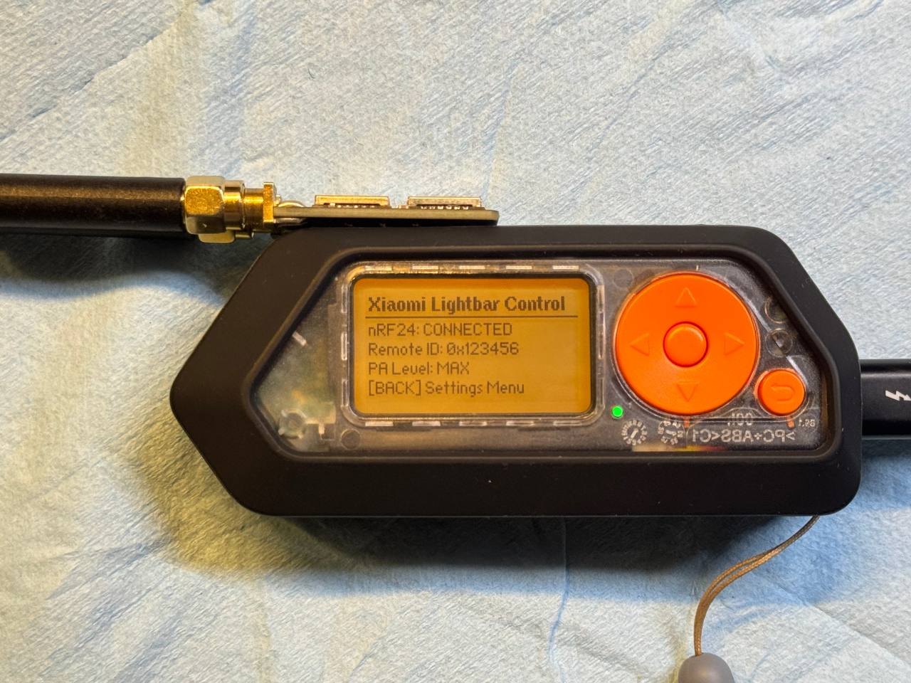
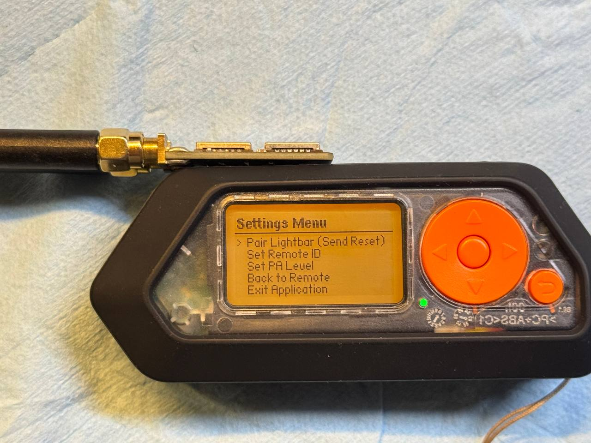

# Xiaomi Lightbar Flipper Zero App

[](#verified)

A custom Flipper Zero application (`.fap`) to control the **Xiaomi Mi Computer Monitor Light Bar (Model MJGJD01YL)** using an external **nRF24L01** module.




## Verified

✅ **Tested end to end on real hardware — the light bar responds to every control.**

| | |
| :--- | :--- |
| **Flipper** | Flipper Zero, target `f7` (MNTM-011 / `Tacoin`) |
| **Firmware** | Momentum `mntm-dev`, API 79.2 |
| **nRF24** | external nRF24L01+ module, wired as per the [pinout](#pinout-configuration) below |
| **Light bar** | Xiaomi Mi Computer Monitor Light Bar **MJGJD01YL** (the non-BLE model) |
| **Confirmed working** | power toggle · brightness up/down · colour temperature warmer/cooler |
| **Also verified** | remote-ID editing and persistence (the saved `config.bin` changes byte-for-byte) · settings-menu navigation |

The packet builder is also covered by a host-side unit test (`test/`, 16 checks)
that reproduces the four packets captured during the original reverse
engineering byte for byte — see [Tests](#tests).

> ⚠️ The **MJGJD02YL** (1S, Bluetooth) model will **not** work: it has no
> 2.4 GHz receiver. Check the label on the bar before buying an nRF24 module.

---

## Features

- **Standard Remote Controls**: Toggles power, adjusts brightness, and modifies color temperature.
- **Settings Menu**: Enter the configuration interface with a short press of the **Back** key.
- **Persistent Storage**: Save your configured **Remote ID** and **PA Level** directly to the SD card (`/ext/apps_data/xiaomi_lightbar/config.bin`). Settings are automatically loaded when starting the application.
- **Digit-by-Digit ID Editing**: Modify your 3-byte Remote ID directly inside the application GUI.
- **PA Level Selection**: Set nRF24 transmit power level to `MIN`, `LOW`, `HIGH`, or `MAX`.
- **Frequency Hopping**: Emulates the physical remote by hopping across channels 6, 15, 43, and 68 (15 repetitions per channel) to guarantee reliable communication.
- **Improved Concurrency**: Executes transmission outside the state mutex lock to ensure the Flipper GUI rendering thread remains smooth.

---

## Pinout Configuration

Connect your nRF24L01 module to the Flipper Zero GPIO pins as follows:

| nRF24 Pin      | Flipper Pin      | Function                     |
| :------------- | :--------------- | :--------------------------- |
| **GND**        | Pin 8 (GND)      | Ground                       |
| **VCC (3.3V)** | Pin 9 (3V3)      | Power                        |
| **CE**         | Pin 6 (PB2)      | Chip Enable                  |
| **CSN**        | **Pin 13 (PC3)** | **Manual CSN (Chip Select)** |
| **SCK**        | Pin 12 (PB3)     | SPI Clock                    |
| **MOSI**       | Pin 15 (PA7)     | SPI MOSI                     |
| **MISO**       | Pin 16 (PA6)     | SPI MISO                     |

_Note: A decoupling capacitor (e.g. 4.7µF to 10µF) across VCC and GND on the nRF24 module is highly recommended for signal stability._

---

## How to Use

### 1. Key Bindings

- **OK (Short Press)**: Toggle Power (On / Off).
- **Up / Down**: Brightness Increase / Decrease.
- **Left / Right**: Color Temperature Warmer / Cooler.
- **Back (Short Press)**: Enter / Return from Settings Menu.
- **Back (Long Press)**: Exit App from any screen.

### 2. Pairing a New Lightbar

1. Unplug and replug the power cable of the Xiaomi lightbar.
2. Within 20 seconds, open the Settings Menu on the Flipper app and select **Pair Lightbar (Send Reset)**.
3. The lightbar will flash to indicate successful pairing.

---

## Protocol notes

The light bar takes a fixed 17 byte packet over a bare 2.4 GHz link:

| offset  | size | field                                        |
| :------ | :--- | :------------------------------------------- |
| 0..7    | 8    | preamble `53 39 14 DD 1C 49 34 12` (fixed)   |
| 8..10   | 3    | remote id                                    |
| 11      | 1    | separator `FF`                               |
| 12      | 1    | counter (increments per command)             |
| 13..14  | 2    | command                                      |
| 15..16  | 2    | CRC16 over bytes **0..14**                   |

Two details are easy to get backwards, and in both cases the bar fails
*silently* -- it just ignores the packet:

- the **counter comes before the command**, not after it;
- the **CRC covers all 15 preceding bytes, preamble included** (poly `0x1021`,
  init `0xFFFE`, no reflection, xorout `0`).

The nRF24 sends `preamble + address + payload`; filling the 5 byte address with
`0x5555555555` extends the bar's sync sequence, so the 17 byte packet rides along
as the payload. CRC and auto-ack are switched off, data rate is 2 Mbps, and the
packet is repeated across channels 6, 15, 43 and 68.

Reverse engineered by [lamperez](https://github.com/lamperez/xiaomi-lightbar-nrf24).

## Tests

`test/` builds the packet builder on a PC (no Flipper needed) and checks it
against the four packets captured during the original reverse engineering:

```sh
gcc -std=c11 -Wall -Wextra -I. -Itest/stubs \
    -o test/test_protocol.exe test/test_protocol.c xiaomi_protocol.c
./test/test_protocol.exe
```

## How to Build

The application uses the micro Flipper Build Tool (`ufbt`). To compile, install `ufbt` via Python and run:

```bash
pip install ufbt
ufbt
```

The compiled package will be available at:
`dist/xiaomi_lightbar.fap`
